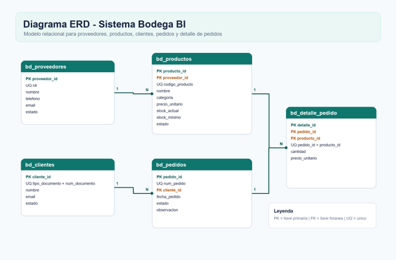
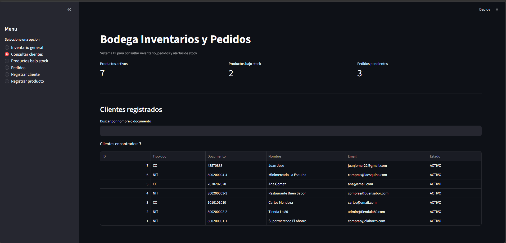
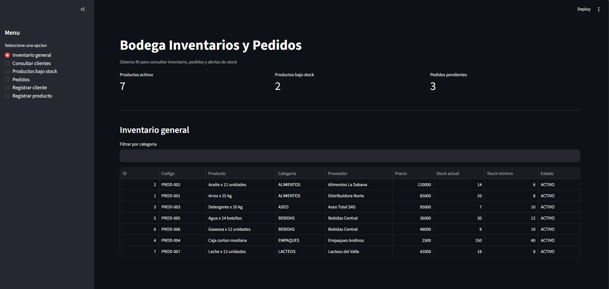
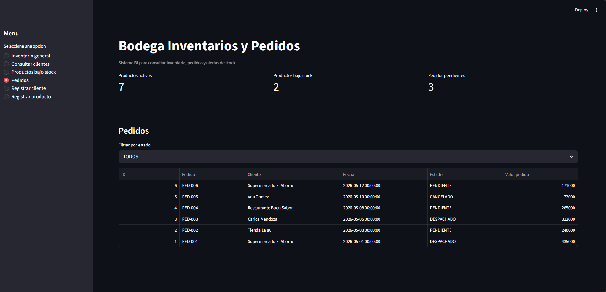
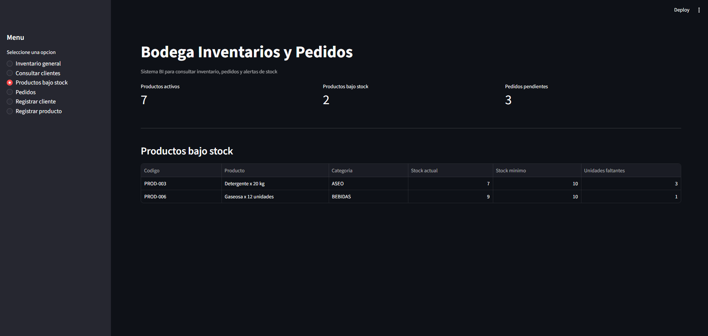
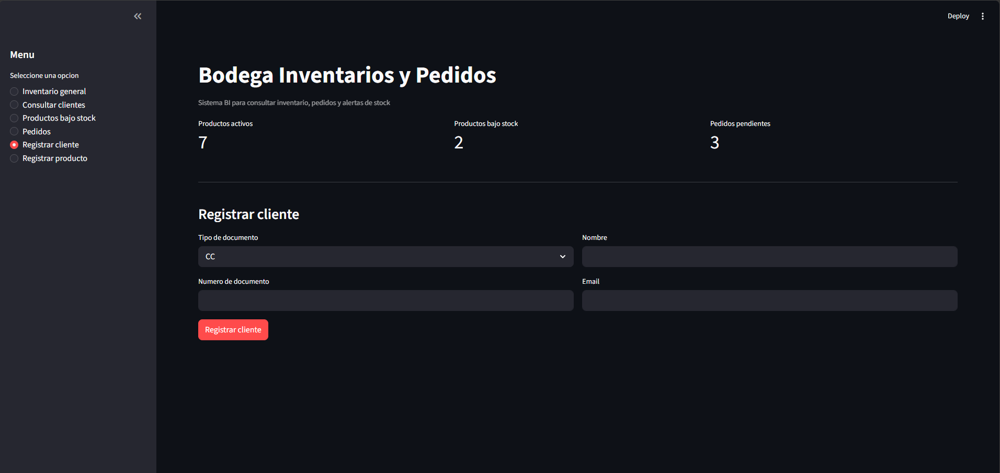
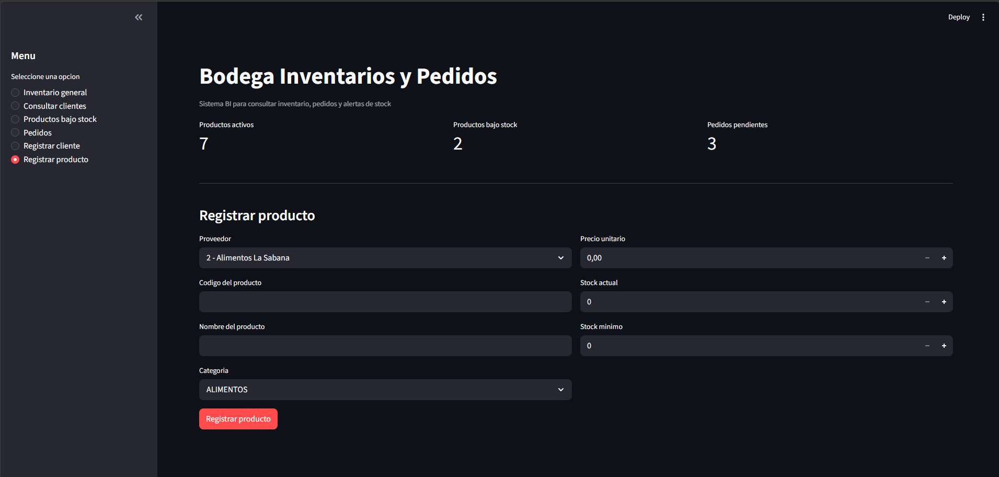

# Bodega BI — Sistema de Inventarios y Pedidos

Aplicación web para gestionar el inventario, los clientes y los pedidos de una bodega distribuidora. Desarrollada con Streamlit y conectada a Oracle Cloud.

---

## Integrantes

- Jose Miguel Jaramillo G
- Juan José Márquez H

---

## Dominio elegido

**Bodega / Gestión de inventario y pedidos**

Se eligió este dominio porque representa un caso de negocio real y cotidiano: una bodega distribuidora que necesita controlar su inventario de productos, gestionar sus proveedores y clientes, registrar pedidos y detectar alertas de stock bajo. El modelo requiere múltiples entidades relacionadas (proveedores, productos, clientes, pedidos y detalle de pedidos), lo que justifica una base de datos relacional con restricciones de integridad bien definidas.

---

## Estructura del repositorio

```
Proyecto_Final_Introduccion_BI/
├── app/
│   ├── .env.example
│   └── main.py
├── imagenes/
│   └── (capturas de pantalla)
├── scripts/
│   ├── ddl.sql
│   ├── dml.sql
│   └── queries.sql
├── README.md
└── requirements.txt
```
---

## Diagrama ERD
El modelo se centra en cinco entidades. Proveedores alimenta productos; clientes generan pedidos; cada pedido puede contener varios productos por medio de la tabla detalle.





| Entidad | Descripción |
|---|---|
| `bd_proveedores` | Almacena datos de proveedores y su estado operativo. |
| `bd_productos` | Registra productos, categoría, precio, proveedor y niveles de stock. |
| `bd_clientes` | Contiene clientes con documento único y estado. |
| `bd_pedidos` | Representa pedidos realizados por clientes, con fecha, estado y observación. |
| `bd_detalle_pedido` | Resuelve la relación muchos-a-muchos entre pedidos y productos. |

---

### Relaciones principales

| Relación | Interpretación |
|---|---|
| `bd_proveedores` 1:N `bd_productos` | Un proveedor puede suministrar muchos productos; cada producto pertenece a un proveedor. |
| `bd_clientes` 1:N `bd_pedidos` | Un cliente puede tener varios pedidos; cada pedido pertenece a un cliente. |
| `bd_pedidos` 1:N `bd_detalle_pedido` | Un pedido puede tener varios renglones de detalle. |
| `bd_productos` 1:N `bd_detalle_pedido` | Un producto puede aparecer en muchos detalles de pedido. |


---

## Tablas y restricciones

El modelo tiene 5 tablas:

- **`bd_proveedores`** — guarda los proveedores que abastecen la bodega. El NIT es único para que no se pueda registrar el mismo proveedor dos veces.
- **`bd_clientes`** — registra clientes (personas o empresas). La combinación de tipo y número de documento es única, porque distintos tipos de documento pueden compartir números.
- **`bd_productos`** — catálogo de productos. Cada uno tiene un código único, está vinculado a un proveedor y registra stock actual y mínimo. El precio y el stock no pueden ser negativos.
- **`bd_pedidos`** — encabezado de cada pedido. Está vinculado a un cliente y tiene tres estados posibles: `PENDIENTE`, `DESPACHADO` o `CANCELADO`.
- **`bd_detalle_pedido`** — las líneas de productos dentro de un pedido. No se puede repetir el mismo producto en un mismo pedido, y la cantidad debe ser mayor a cero.

---

## Reglas de negocio implementadas

- **NIT único en proveedores:** evita registrar al mismo proveedor dos veces.
- **Documento único en clientes:** identifica a cada cliente de forma inequívoca.
- **Código de producto único:** es la referencia interna de cada ítem en la bodega.
- **Precio y stock no negativos:** no tienen sentido valores negativos en contexto real.
- **Cantidad > 0 en detalle:** pedir cero unidades de algo no tiene lógica de negocio.
- **Estados controlados con CHECK:** solo se aceptan valores definidos en el proceso (activo/inactivo, pendiente/despachado/cancelado), evitando datos inconsistentes.
- **Claves foráneas:** un producto siempre pertenece a un proveedor existente; un pedido siempre pertenece a un cliente existente; el detalle siempre apunta a pedidos y productos reales.

---

## Cómo ejecutar la aplicación

**Requisitos:** Python 3.10+, Oracle Instant Client 23.x y acceso a Oracle Cloud.

**1. Clonar el repositorio**
```bash
git clone https://github.com/tu_usuario/bodega-bi.git
cd bodega-bi
```

**2. Instalar dependencias**
```bash
pip install -r requirements.txt
```

**3. Configurar credenciales**
```bash
cp .env.example .env
```
Editar `.env` con usuario, contraseña y DSN de Oracle.

**4. Crear tablas y cargar datos de prueba**

Ejecutar en Oracle SQL Developer en este orden:
```sql
@ddl.sql
@dml.sql
```

**5. Correr la aplicación**
```bash
streamlit run main.py
```

La app queda disponible en `http://localhost:8501`.


---

## Capturas de pantalla













---

## Reflexión del equipo

**Dificultades encontradas:**
- Dificultades encontradas
-	Conectar la aplicacion con Oracle requirio separar credenciales, wallet e Instant Client para evitar datos sensibles en el codigo.
-	El diseno relacional exigio cuidar llaves primarias, foraneas, restricciones de unicidad y estados validos para mantener integridad.
-	Fue necesario convertir consultas SQL en informacion clara para el usuario final, no solo tablas tecnicas.
-	La interfaz inicial funcionaba, pero necesitaba jerarquia visual, metricas y filtros para sentirse como una herramienta BI completa.
- Las operaciones de registro demandaron validaciones y manejo de errores para que la app no fallara ante datos incompletos o duplicados.


**Aprendizajes:**
-	Un buen proyecto de base de datos no termina en el DDL: tambien necesita consultas utiles, visualizacion y criterios de negocio.
-	Las restricciones SQL reducen errores desde la fuente y hacen que la aplicacion sea mas confiable.
-	Streamlit permite construir rapidamente tableros funcionales, pero la calidad mejora mucho al cuidar estados, filtros y organizacion visual.
-	Separar configuracion en `.env` facilita mover el proyecto entre equipos sin exponer credenciales.
-	El ERD ayuda a explicar el sistema a personas tecnicas y no tecnicas, porque muestra las dependencias reales del negocio.


